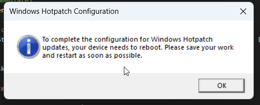

# 🛠️ Windows Hotpatch Remediation for ARM64 Devices

## ✅ Purpose

This remediation script enables **Windows Hotpatching** on **Arm64-based Windows devices** by disabling the use of CHPE (Compiled Hybrid PE) binaries, which are incompatible with Hotpatch.

> 💡 **Note**: Hotpatch support for ARM64 devices is currently in **Public Preview**. CHPE must be disabled for Hotpatch updates to apply successfully.

---

## ⚙️ What the Script Does

1. Detects whether the device is running on an **ARM64 CPU**.
2. Sets the following registry key to **disable CHPE**:
    
    Path: HKLM\SYSTEM\CurrentControlSet\Control\Session Manager\Memory Management
    
    Name: HotPatchRestrictions
    
    Type: REG_DWORD Value: 1


3. Creates a **Scheduled Task** under the currently logged-in user's session to show a **PowerShell popup** asking the user to reboot.
4. Immediately runs the scheduled task to notify the user.

---

## 🖥️ Requirements

- Device must be **Windows on ARM64**
- There must be an **active user session** for the popup to display
- The remediation script must be **run in SYSTEM context**
- Supports Windows 11 builds with ARM64 Hotpatch preview

---

## 📂 Files

| File Name      | Description                                  |
|----------------|----------------------------------------------|
| `remediate.ps1` | Remediation script to disable CHPE and notify user |
| `README.md`    | This documentation                           |

---

## 📦 Deployment via Microsoft Intune

1. Go to the **Microsoft Intune Admin Center**.
2. Navigate to: Devices > Remediations > Create script package
3. Upload `remediate.ps1` as your **remediation script**.
4. Optionally upload a **detection script** (see below).
5. Configure these options:
- **Run script in 64-bit PowerShell**: ✅ Yes
- **Run this script using the logged-on credentials**: ❌ No (must run as SYSTEM)
6. Assign the script package to a device group with ARM64 devices.
7. Set an appropriate schedule (e.g., daily or weekly).

---

## 🔍 Detection Script (Optional)

Use this detection script to check compliance — it returns a non-zero exit code if CHPE is still enabled.

```powershell
$cpuArch = (Get-CimInstance Win32_Processor).Architecture
$registryPath = "HKLM:\SYSTEM\CurrentControlSet\Control\Session Manager\Memory Management"
$registryName = "HotPatchRestrictions"

if ($cpuArch -eq 12) {
 try {
     $value = Get-ItemPropertyValue -Path $registryPath -Name $registryName -ErrorAction Stop
     if ($value -eq 1) {
         exit 0
     } else {
         exit 1
     }
 } catch {
     exit 1
 }
} else {
 exit 0 # Not applicable on non-ARM64 devices
}

```

🧪 Example Popup Prompt

✳️ This popup appears via scheduled task in the user session when CHPE is disabled.


⚠️ Important Notes
CHPE includes native ARM64 code to boost performance for x86 apps. Disabling it may affect app performance or compatibility.

Test thoroughly in a pilot group before organization-wide rollout.

If you later choose to re-enable CHPE, set HotPatchRestrictions to 0 and reboot the device.

👨‍💻 Author
Maxime Guillemin
🔗 cloudflow.be
📘 @MG-Cloudflow on GitHub


